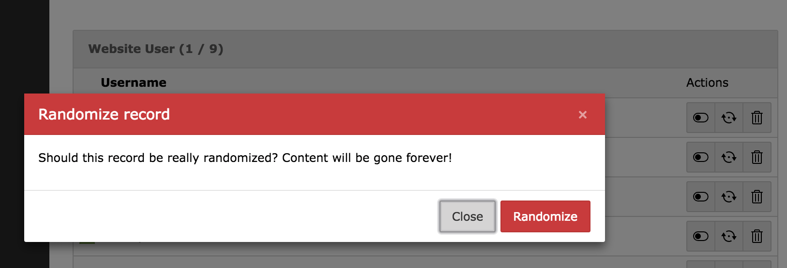

[<- back](../Readme.md)

# Working with personal data

The General Data Protection Regulation requires that people can revoke access to their data and that this data must be removed.

The extension makes it possible to exclude any record by activating a checkbox. After that, the record won't be accessible and available anymore, no matter if backend or frontend, editor or admin.


A new administration module gives editors the possibility to handle those flagged records and react with one of the following options:

- Completely remove the record from the database
- Reactivate the record
- Randomize content of the record [see Randomization](Randomization.md)



Every action regarding those flags is logged in a central place.


## Configuration

The following code what is needed to add a custom table to the GDPR extension.
The code must be placed in the file `Configuration/TCA/Overrides/<tableName/>.php`

```php
<?php
$tca = \GeorgRinger\Gdpr\Service\Tca::getInstance('<tableName>');
$tca
    ->addRestriction('gdpr_restricted') // name of the field used for the checkbox to flag records 
    -add('after:disable'); // positioning of the new field
````

## Technical background

The implementation is based on the `RestrictionContainers` of the TYPO3 core.

### Drawbacks

The limitation of the implementation is that only records having a TCA configuration are covered.
Furthermore direct access to the database without using the `QueryBuilder` of TYPO3 will still deliver every record.

